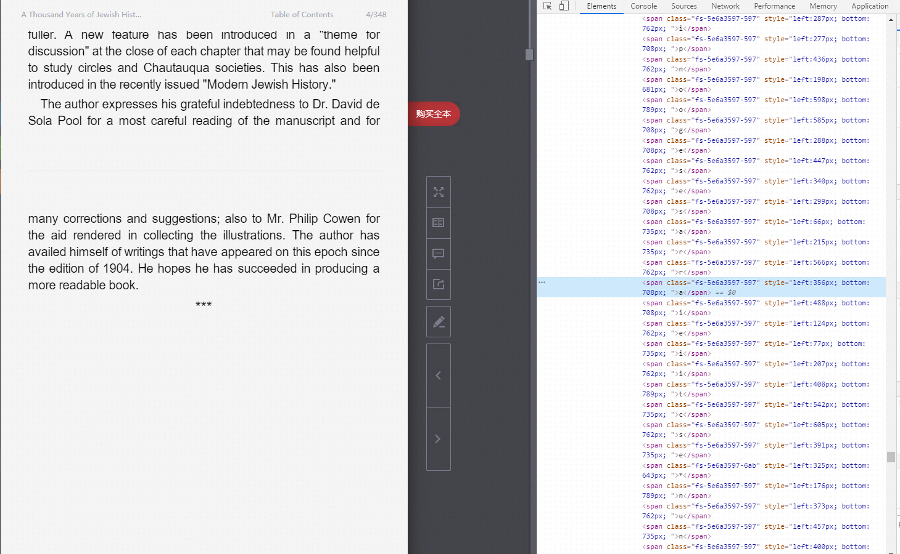

### 网页文字防止复制的解决方法

以当当网为例

调试模式如图所示：已经变成杂乱的标签




#### 思路

仔细观察这两行

```
<span class="fs-5e6a3597-597" style="left:566px; bottom:762px; ">r</span>
<span class="fs-5e6a3597-597" style="left:488px; bottom:708px; ">i</span>
```

发现了规律，style="left:566px; bottom:762px; 里面有两个数字，左边距和下边距

那么我们可以采集这一页所有的内容进行排序，岂不是就能合成一本书了？

使用一个二维可变长数组对数据进行排序

一维的放bottom 相同的所有字的数组

然后再对每个数组的二维进行顺序排序，即可得出文章的正确顺序


#### 代码使用

需要对book目录下的 **RequestBookPage.py**文件进行编辑

需要修改代码中的链接

elementUrl：书本的每一页的数据接口

catalogUrl ： 目录接口

headers ：请求头

token ：用户令牌

都可以通过浏览器调试模式获得，不做赘述

需要注意的是，elementUrl 链接中有动态参数，需要改一下

token={token}

chapterID={chapterID}

pageIndex={pageIndex}

locationIndex={locationIndex}

这几个需要按这个格式来写，后来进行动态解析填充参数

搭配这行代码使用的：

     url = elementUrl.format(token=self.token, pageIndex=catalog['pageIndex'], chapterID=catalog['chapterID'],
                                    locationIndex=num)


免责声明：

本文和demo仅供学习用途

请勿用于商业用途

